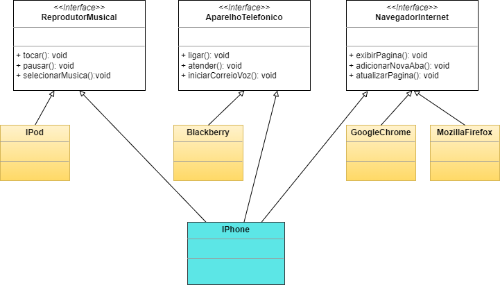

# DIO - Trilha Java Básico

Modelagem e diagramação da representação em UML do componente iPhone com base em seu vídeo de lançamento em 2007.

Representação dos papéis do iPhone de: Reprodutor Musical, Aparelho Telefônico e Navegador na Internet, criando as classes e interfaces no formato de arquivos .java

## Descrição do Desafio

[GitHub - DIO](https://github.com/digitalinnovationone/trilha-java-basico/tree/main/desafios/poo)

## Diagrama UML

